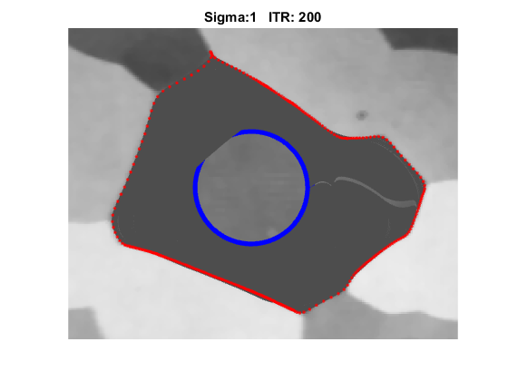

# Classic Image Segmentations

Classic Image Segmentations with popular region-based active contour models using Matlab

## [Chan-Vese-active-contour-model](Chan-Vese-active-contour-model)
Active Contour Without Edges - Chan Vese active contour model

 

## [LBF-active-contour-model](LBF-active-contour-model)
Implicit Active Contours Driven by Local Binary Fitting Energy

 

## [Snake-segmentation-with-Matlab](Snake-segmentation)
Image segmentation With Snake deformable model with Multi Scale Potenital Gaussian External Force

